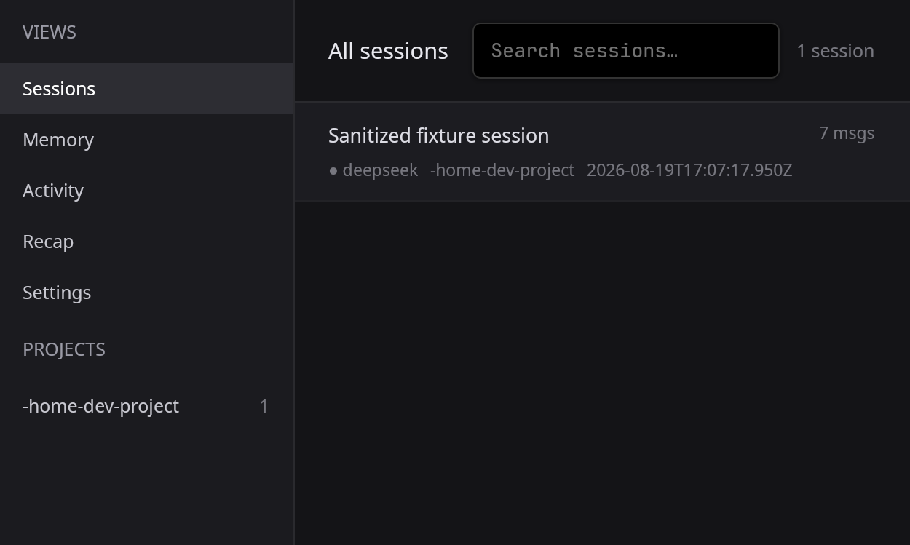
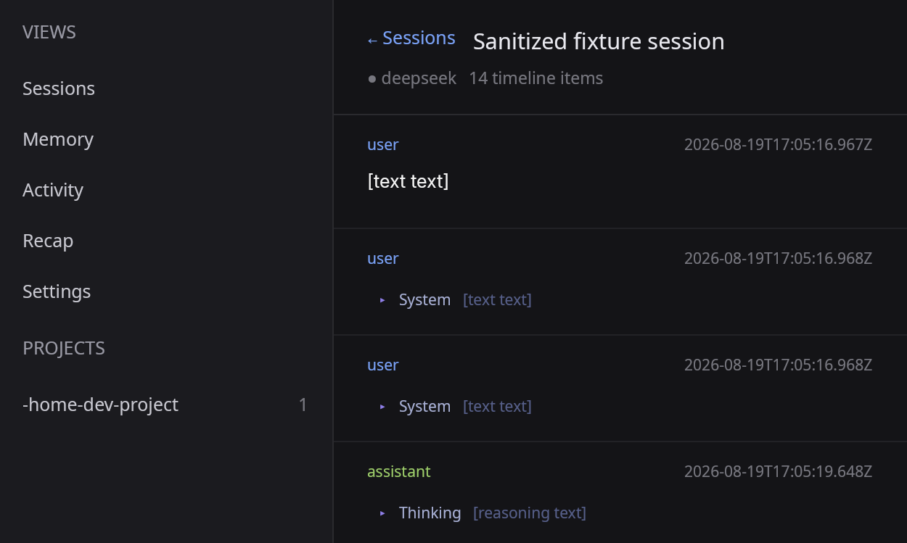

<div align="center">

<picture>
  <source media="(prefers-color-scheme: dark)" srcset=".github/assets/obelisk-wordmark-d.svg">
  
</picture>

[](https://github.com/eric8810/obelisk/stargazers)
[](https://github.com/eric8810/obelisk/releases)
[](LICENSE)

Past Claude Code, Codex, Kimi Code, Pi, and DeepSeek Harness sessions -- queryable by your agent, browsable by you.

</div>

> **Copyright notice.** This repository is a derivative of the original
> [tommy0103/obelisk](https://github.com/tommy0103/obelisk) project. **All
> copyright and rights in this work belong to tommy0103 and contributors.**
> It is distributed here under the same AGPL-3.0-only license, with the
> original copyright notices preserved.

<br />

## Two sides of the same index

Obelisk has two sides that share one SQLite index:

**Agent side** — the `obelisk` CLI (a standalone Rust binary) owns the local runtime, while a separate agent skill teaches coding agents how to search and query their session history. The agent writes JS queries, runs them locally, and answers in plain language.

**App side** — a native desktop app (Rust + GPUI) for humans to browse sessions, manage memories, view usage stats, and see weekly recap cards. The app is tray-resident: its daemon watches the provider trees, maintains the index incrementally, and owns index writes while it runs (ADR-0013 Stage 3).

Both read from the same `~/.obelisk/obelisk.sqlite` database. The indexer reads Claude Code transcripts from `~/.claude/projects`, Codex transcripts from `~/.codex/sessions` and `~/.codex/archived_sessions`, Kimi Code sessions from `~/.kimi-code/sessions` (or `$KIMI_CODE_HOME/sessions`), Pi sessions from `~/.pi/agent/sessions`, and DeepSeek Harness sessions from `~/.dsh/sessions` (or `$DSH_HOME/sessions`).

## Multi-provider support

Obelisk indexes every provider into the same SQLite schema instead of keeping separate databases. Rows carry a `source` value, and non-Claude IDs are provider-prefixed so they cannot collide.

Codex root threads become normal Obelisk sessions. Codex child threads are attached through the same `subagents` table when parent-thread metadata is available. Codex does not emit Claude-style workflow metadata, so workflow tables may be empty for Codex-only history.

Kimi session directories become one Obelisk session each. Main and child-agent `wire.jsonl` streams are projected into the same messages, tools, summaries and subagents tables. Undo/clear is handled as a full session replay, so retracted wire records do not remain in the index.

Pi JSONL v1-v3 sessions are projected through the same provider contract. Pi's tree, branch summaries, compactions, durable leaf, retained checkpoint tail, custom messages, bash records, tool calls, token usage, and raw JSONL evidence stay inside the adapter; no Pi-specific database or renderer branch is needed. Active visibility follows Pi's own context rules: a retained tail replaces pre-compaction ancestors even when those physical entries still exist and bounds any later legacy compaction, while a legacy-only chain retains ancestors beginning at `firstKeptEntryId`. Missing parents form orphan branch roots, matching Pi's recovery behavior. Pi entries that the source explicitly superseded are stored as `inactive`: the app and normal agent queries omit them, while supported query helpers can include them with `includeInactive: true`. Display-suppressed or transport-only records remain `hidden` and are never returned by those helpers.

| Provider | Superseded-history support |
| --- | --- |
| Pi | Branch, leaf, and compaction state attests inactive history |
| Kimi Code | Undo/clear can attest supersession; preservation is a follow-up |
| Claude Code | The source does not attest rewind or current-leaf state |
| Codex | Sessions have no branching semantics |

Because Pi's explicit `--session-id` is project-local, Obelisk combines the header ID with a deterministic hash of the normalized header `cwd`; this keeps the identity stable across file moves and v1-v3 migration while allowing two projects to use the same custom ID. Replacement and deletion replay is provenance-aware, so stale session snapshots are retracted atomically; compaction and branch-summary model usage is included in usage totals.

For live app refresh, Obelisk watches the roots declared by every registered provider, including `~/.claude/projects`, `~/.codex/sessions`, `~/.codex/archived_sessions`, `~/.kimi-code/sessions`, and `~/.pi/agent/sessions`. Codex's `session_index.jsonl` is used as lightweight title/update metadata during indexing, not as the message transcript source.

Pi chooses its session directory in this order: `--session-dir`, `PI_CODING_AGENT_SESSION_DIR`, `sessionDir` in settings, then the default under `~/.pi/agent/sessions`. Obelisk automatically follows absolute or `~`-prefixed environment/global settings and the project setting for Obelisk's launch cwd; a relative project setting is resolved against that cwd. CLI-only roots, relative environment/global settings, and project settings from another launch cwd cannot be inferred safely, so select the resolved directory in Obelisk **Settings** instead of letting Obelisk guess.

## Skill: agent-first retrieval

<div align="center">
  
</div>

You can use obelisk like:

```
/obelisk 上次 auth bug 最后到底改了哪些文件，为什么这么改
/obelisk 这个文件最近在哪些 sessions 里被反复修改
/obelisk 找出最近失败的 tool calls，它们分别发生在哪些任务里
/obelisk 那个 review workflow 的 subagents 各自结论是什么
/obelisk recap this week
```

### Install

#### Let your agent install it (recommended)

The shortest path is to give the bootstrap guide directly to a coding agent
with shell access. Paste this as a prompt into Claude Code, Codex, or another
agent — not into your terminal:

```text
Install Obelisk by fetching and following this guide:
curl -fsSL https://raw.githubusercontent.com/eric8810/obelisk/main/SKILL.md
```

The agent will ask before changing your machine, install and verify the CLI,
then ask whether the formal `/obelisk` skill should be installed for the current
project or globally. The bootstrap guide is only for one-time setup; it is not
the query skill itself.

#### Install manually

The default path is the standalone Rust binary — no Node.js required:

```bash
curl -fsSL https://raw.githubusercontent.com/eric8810/obelisk/main/install.sh | sh
obelisk --version
```

The npm-distributed wrapper (identical binary, npm-managed) is still available
for teams that prefer it:

```bash
npm install --global @obelisk-apps/cli
```

Then install the agent skill:

```bash
obelisk install
```

`obelisk install` delegates to the standard skills installer for
`tommy0103/obelisk-skill`.

Then in any Claude Code session:

```
/obelisk <your question>
```

First run builds the index (~5 seconds for 100 sessions). After that it rebuilds incrementally.

### How it works

```
You ask a question
  ↓
Agent writes a JS query against the SQLite index
  ↓
Runs it via obelisk --query <script>
  ↓
Reads the JSON result, answers in natural language
```

Core API: `search()`, `context()`, `sql()`, plus structured helpers (`sessions`, `memories`, `summaries`, `workflows`, `failures`, `fileHistory`, etc). Queries run in a QuickJS sandbox (rquickjs) with a 30s kill switch covering both synchronous loops and loops after `await`.

### Memory layer

When a retrieval produces a conclusion worth keeping, the agent proposes a markdown memory file. After user approval, it registers the file with `obelisk --attune <script>`. Memories are recalled via `memories()` in future sessions — a synthesis cache, not a replacement for raw evidence.

## App: A surface for humans

A companion desktop app for browsing the same index. The app is tray-resident:
closing its window keeps the process alive (and the index fresh); quitting it
hands index writes back to the CLI.

<div align="center">
  
  
</div>

- **Sessions** — browse all sessions with search (full-text, same FTS as the CLI), project filtering, readable tool calls (diffs, terminal output, file references)
- **Timeline** — full session timeline with images, branch disclosure, and live follow-tail while the daemon indexes
- **Memory** — list and detail views for registered memory files
- **Activity** — usage stats per model/project/session
- **Recap** — weekly recap cards (weeks start Monday, ISO week labels)
- **Settings** — provider roots, editor scheme for file references

Prebuilt binaries are published from
[Releases](https://github.com/eric8810/obelisk/releases). The source app can be
run locally on Linux, macOS, and Windows (a GPU/software-Vulkan-capable display
is required for GPUI).

### Run locally

```bash
git clone https://github.com/eric8810/obelisk.git
cd obelisk
cargo run --release -p obelisk-app
```

On first run, Obelisk creates `~/.obelisk/obelisk.sqlite`, indexes the
available registered-provider transcripts, and then watches them for changes.
The default sources include `~/.claude/projects`, `~/.codex/sessions`,
`~/.codex/archived_sessions`, `~/.kimi-code/sessions`, and
`~/.pi/agent/sessions`; point the app at different directories via
`~/.obelisk/settings.json` (`providerRoots`).

The development app reads and updates the real `~/.obelisk` index. Back it up
before testing destructive rebuilds. For an isolated run, launch with a
disposable home directory (`HOME=/tmp/obelisk-dev cargo run --release -p obelisk-app`
on macOS/Linux) and configure fixture source directories in settings.

## What gets indexed

| Layer | Source | What's captured |
|-------|--------|----------------|
| **Sessions** | Claude `<project>/<sessionId>.jsonl`; Codex `sessions/YYYY/MM/DD/*.jsonl` and `archived_sessions/*.jsonl`; Kimi session directories; Pi recursive `*.jsonl`; DeepSeek Harness `<project>/<sessionId>/session.jsonl[.zstd]` | Title, project, timestamps, git branch, source |
| **Messages** | user + assistant turns | Full text, model, token usage, parent chain |
| **Tool calls** | every tool invocation | Tool name, input, file paths |
| **Subagents** | Claude `subagents/agent-<id>.jsonl`; Codex child threads; DeepSeek Harness child sessions (folded into the root session) | Agent type, description, full conversation |
| **Workflows** | Claude `workflows/wf_<runId>.json` | Script, result, agent count |
| **Workflow agents** | Claude `subagents/workflows/wf_<runId>/` | Per-agent transcripts |
| **Memories** | registered markdown files | Conclusions linked to source sessions |

Full-text search via FTS5 covers all layers.

## Structure

```
crates/
├── obelisk-core/              # providers, persist, schema, lease, watcher, sandbox
│   ├── src/providers/         # Claude, Codex, Kimi, Pi, DeepSeek Harness adapters
│   ├── src/query.rs           # Query/attune sandbox API (helpers)
│   ├── src/indexer.rs         # Skill orchestration (discover → persist → finalize)
│   ├── src/watcher.rs         # Hybrid notify+poll watcher (ADR-0009)
│   ├── src/writer_lease.rs    # Cross-process single-writer lease (SQLite lock DB)
│   └── src/schema.sql         # SQLite schema (single source of truth)
├── obelisk-cli/               # Thin binary, same CLI contract as before
└── obelisk-app/               # GPUI desktop app (timeline, views, resident daemon)

packages/dsh-plugin/           # DSH Cordis plugin (TypeScript, skill chain)
skill-doc/                     # Source for the docs-only obelisk agent skill
├── SKILL.md                   # Query and memory workflow
└── references/                # Progressive-disclosure API/schema/pattern docs
    └── recap/                 # Per-card recap retrieval + writing references

packaging/
├── build-skill.mjs            # Builds the docs-only skill artifact
├── npm-wrapper/               # npm package that dispatches to the Rust binary
└── publish-skill.sh

tests/
├── e2e/                       # CLI E2E: 13 black-box scenarios (C1–C13)
├── e2e-desktop/               # Desktop E2E: 11 scenarios (D1–D11)
├── golden/                    # Frozen corpus + expected dump (Rust is the spec now)
└── fixtures/                  # Per-provider corpus fixtures

docs/adr/                      # Architecture decision records (0001–0013)
docs/history/                  # Retired TS baseline artifacts (M1.0 reference)
SKILL.md                       # Remote one-time CLI + skill bootstrap guide
install.sh                     # POSIX installer (binary default, --npm wrapper)
CONTEXT.md                     # Project glossary
```

The optional `/obelisk recap` flow is loaded only for explicit `/obelisk recap` intent.
It starts at `skill-doc/references/recap/overview.md` and proceeds card-by-card:

- `skill-doc/references/recap/pattern1-cover.md` + `skill-doc/references/recap/writing1-cover.md`
- `skill-doc/references/recap/pattern2-thinking.md` + `skill-doc/references/recap/writing2-thinking.md`
- `skill-doc/references/recap/pattern3-vibe.md` + `skill-doc/references/recap/writing3-vibe.md`
- `skill-doc/references/recap/pattern4-workflow.md` + `skill-doc/references/recap/writing4-workflow.md`
- `skill-doc/references/recap/pattern5-closing.md` + `skill-doc/references/recap/writing5-closing.md`

### Generated build outputs

- `dist/obelisk-skill/` is produced by `npm run build:skill`. It is the
  docs-only skill artifact: `SKILL.md`, references, and skill package metadata.
- Skill publishing stages that artifact at `skills/obelisk/` in the
  `obelisk-skill` repository; only `README.md` and `LICENSE` remain at the
  repository root for `npx skills` discovery.
- `target/release/obelisk` and `target/release/obelisk-app` are the Rust
  binaries built by cargo.

## Implementation Notes

The index rebuilds incrementally — only new or modified JSONL files are re-parsed.
While the desktop app runs, its resident daemon is the active indexer: it
watches the provider trees and refreshes the `__app_heartbeat__` marker every
30s. A fresh marker means the daemon owns writes, so CLI mutations skip with
`daemon_active` (searches stay available); after the app exits the marker ages
out within 60s and CLI builds recover. A separate SQLite writer lease prevents
cross-process writes from overlapping. The `__app_last_successful_build__`
marker records index freshness, not ownership.

The CLI is a standalone Rust binary with no Node.js runtime dependency; the npm
wrapper dispatches to the same binary. The formal skill contains instructions
and references, not a second executable runtime.

20K lines of scattered JSONL → something the agent can search() and sql() against in milliseconds.

## Contributing

Contributions are welcome. Read [CONTRIBUTING.md](CONTRIBUTING.md) before opening
a PR — it is short, and it is written from what actually blocked past PRs rather
than from generic style rules.

The parts worth knowing up front:

- **Run every claim in your PR description end to end.** The most common reason a
  PR stalls here is a capability that is advertised but unreachable — including
  inputs shown in screenshots.
- **Assert the requirement, not the implementation.** Copy the sentence from the
  issue into your test name.
- **Transcript content is attacker-controlled.** Obelisk indexes third-party
  agent logs; anything reaching the query sandbox, file-reference resolution, or
  DDL is deny-by-default.
- **Re-run verification after merging main.** A merge voids every result above
  it, including your own noted limitations.

`CONTRIBUTING.md` also carries hard constraints per area — provider adapters,
schema migrations, indexing/daemon ownership, and the desktop app. The PR
template mirrors them as per-area checklists.

---

## Star History

<a href="https://www.star-history.com/?repos=eric8810%2Fobelisk&type=date&legend=top-left">
 <picture>
   <source media="(prefers-color-scheme: dark)" srcset="https://api.star-history.com/chart?repos=eric8810%2Fobelisk&type=date&theme=dark&sealed_token=zGsTpxirzDypxpaSUQ4aiPpCQFVFbII1Xl68UlRRpVdaTr6NoPY_cEvprnA9kMMdmXnERYZn3uXo20PkKEiuoGQ8d-qD3nPDanawRUrZuFYnNPytlC2iTw" />
   <source media="(prefers-color-scheme: light)" srcset="https://api.star-history.com/chart?repos=eric8810%2Fobelisk&type=date&theme=light&sealed_token=zGsTpxirzDypxpaSUQ4aiPpCQFVFbII1Xl68UlRRpVdaTr6NoPY_cEvprnA9kMMdmXnERYZn3uXo20PkKEiuoGQ8d-qD3nPDanawRUrZuFYnNPytlC2iTw" />
   
 </picture>
</a>

## License

Copyright (C) 2026 tommy0103 and contributors.

This repository is a derivative of the original obelisk project at
<https://github.com/tommy0103/obelisk>. All copyright and rights in this work
belong to tommy0103 and contributors, the original authors; this repository
claims no ownership beyond what AGPL-3.0 grants to recipients of the source.

Obelisk is licensed under the GNU Affero General Public License v3.0 (AGPL-3.0-only); see [LICENSE](LICENSE). Derivative works are welcome: if you distribute a modified version, please keep the per-file copyright notices intact and mark your modifications prominently with a date, as AGPL-3.0 §5 requires.
